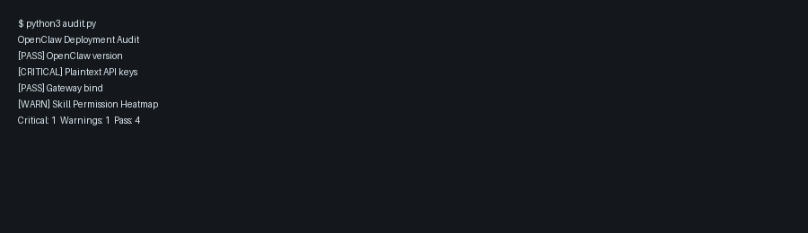
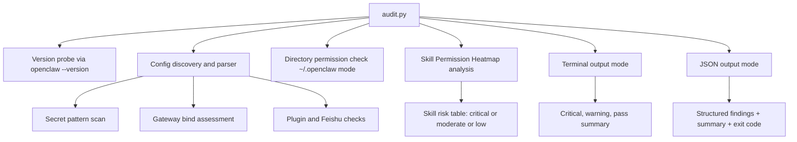

# openclaw-audit

A Python deployment auditor for OpenClaw security posture checks.

## Why this matters

- **Impact:** Reduces deployment risk by surfacing critical misconfiguration and exposure issues quickly.
- **Scale:** Supports host-by-host audits and pipeline integration through JSON output.
- **Use case:** Security baselining for OpenClaw deployments in production and lab environments.

## Demo media

- Screenshot: 
- Demo GIF: 

## Project overview

`openclaw-audit` is a lightweight host-side auditing tool for engineering teams running OpenClaw in production or lab environments. It focuses on high-value checks that map directly to known operational risks and selected CVEs.

The project follows a barbell strategy.

- The core script is intentionally simple, deterministic, and dependency-light.
- The threat model and remediation guidance are detailed, explicit, and suitable for governance and security review.

## Scope of checks

The current `audit.py` release evaluates:

1. **Version exposure check**
   - Flags OpenClaw versions below `2026.1.29` as vulnerable to **CVE-2026-25253**.
2. **Secret handling check**
   - Scans discovered OpenClaw config files (`~/.openclaw/config.json`, `~/.openclaw/openclaw.json`, and root equivalents) for likely plaintext API keys and secrets.
3. **Gateway exposure check**
   - Detects risky bind settings such as `0.0.0.0`.
4. **Environment and permissions check**
   - Evaluates `~/.openclaw` directory permissions and flags non-`700` modes.
5. **Feishu extension check**
   - Detects Feishu extension indicators linked to **CVE-2026-26321** review requirements.
6. **Skill permission heatmap**
   - Performs static analysis of installed OpenClaw skills under `~/.openclaw/skills/` and categorises risk indicators.

## Architecture



## 🛡️ Skill Permission Heatmap

The auditor now includes a Skill Permission Heatmap for agent skill manifests.

It inspects `SKILL.md` files under `~/.openclaw/skills/` and performs static keyword analysis to identify risky capability patterns before runtime. This helps reduce supply-chain risk and lowers the chance of Agentic Cascade Failures caused by unsafe skill composition.

Risk categorisation:

- 🔴 **CRITICAL**: `sudo`, `exec: true`, `chmod`, `base64`, `/bin/bash`, `ssh-add`
- 🟡 **MODERATE**: `curl`, `wget`, `http`, `api_key`, `token`, `requests`
- 🟢 **LOW**: no matching high-risk indicators

Sample output:

| Skill Name | Risk Level | Indicators Found |
|---|---|---|
| infra-deploy | CRITICAL | sudo, /bin/bash, chmod |
| threat-feed-sync | MODERATE | curl, token |
| weather-helper | LOW | none |

This feature is intended to support Agentic Posture Management by making privilege and execution intent visible during audit time.

## Threat model

### Assets

- OpenClaw control plane exposure posture
- API credentials and secrets in local configuration
- Plugin and extension trust boundary
- Version hygiene and vulnerability exposure

### Adversaries

- External attackers scanning public control interfaces
- Opportunistic actors abusing exposed API keys
- Supply chain or plugin abuse paths
- Internal misuse due to insecure defaults and poor segregation

### Trust boundaries

- Local host to OpenClaw gateway
- Configuration file to runtime process
- Plugin ecosystem to core agent execution
- Human operators to automation pipelines

### Primary attack paths

1. Public gateway binding exposes control endpoints.
2. Plaintext keys are exfiltrated from local config.
3. Outdated versions remain unpatched against known CVEs.
4. Risky or unreviewed extensions increase attack surface.

### Security assumptions

- Audit runs with local read access to user OpenClaw config.
- Findings are advisory and should be paired with change control.
- CVE mapping is point-in-time and must be maintained over time.

## Installation

```bash
python3 -m venv .venv
source .venv/bin/activate
pip install -r requirements.txt
```

## Usage

```bash
# Default coloured terminal output
python3 audit.py

# Force a specific config path
python3 audit.py --config /root/.openclaw/openclaw.json

# JSON output for CI, pipelines, and automation
python3 audit.py --json
```

JSON output includes:

- `timestamp`
- `config_path_used`
- `config_paths_attempted`
- `findings`
- `summary`
- `exit_code`

Exit code behaviour:

- `0`: no critical findings
- `2`: one or more critical findings

## Remediation matrix

| Finding | Risk level | Fix |
|---|---|---|
| OpenClaw version below 2026.1.29 | Critical | Upgrade OpenClaw to a patched release and validate runtime version post-deploy |
| Potential plaintext API keys in config | Critical | Move secrets to environment or secret manager, rotate exposed keys, remove plaintext values |
| Gateway bound to 0.0.0.0 | Critical | Bind to loopback (`127.0.0.1` or `loopback`) and expose only through controlled proxy or private network |
| `~/.openclaw` permissions not `700` | Warning/Critical | Restrict directory permissions to owner-only with `chmod 700 ~/.openclaw` and verify ownership |
| Feishu extension detected | Warning/Critical | Disable or remove Feishu integration unless explicitly required and patched; review extension source and access scope |

## Engineering notes

- No heavy third-party libraries are required.
- Script is designed for predictable behaviour in CI and server shells.
- Extend checks by adding pure functions that return structured findings.


## Quick Demo

```bash
# 1) Run a core check
# 2) Request JSON output
# 3) Pipe into jq for analyst workflows
```


## Licence

Apache 2.0
